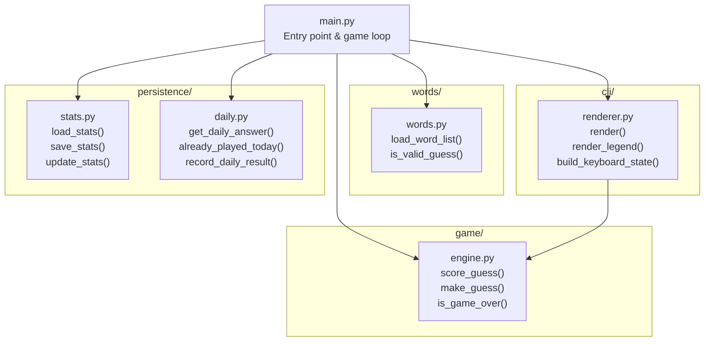
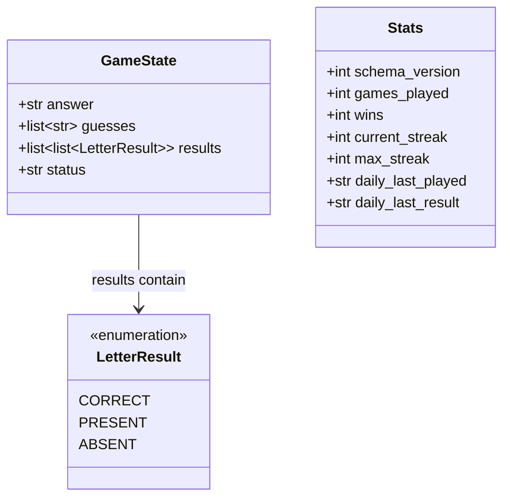
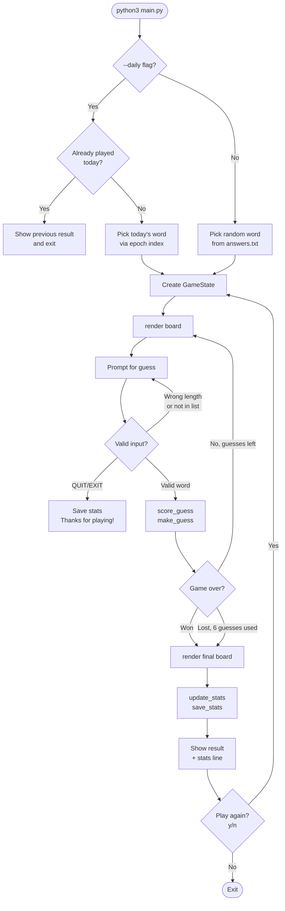
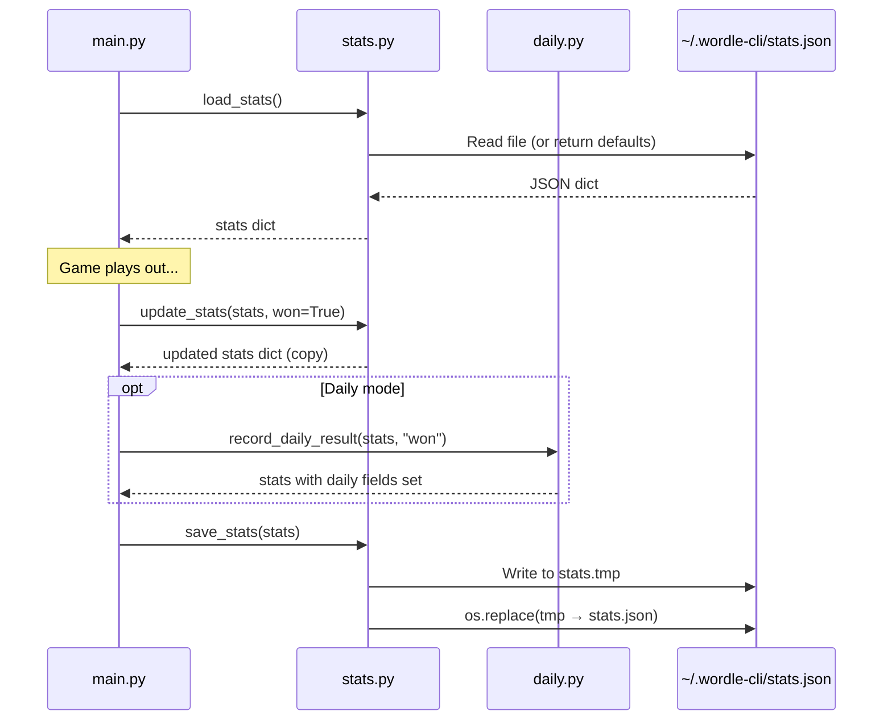
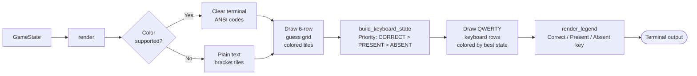

# Wordle CLI — Architecture

## Module Structure

The project is split into four packages plus a thin entry point. Each package has a single responsibility and dependencies only flow inward toward `game/`.



---

## Data Structures

The core data types that flow through the game.



---

## Game Loop Flow

How a single game plays out from launch to result.



---

## Guess Scoring Algorithm

The two-pass algorithm inside `score_guess()` that handles duplicate letters correctly.

```mermaid
flowchart TD
    A["score_guess(guess, answer)"] --> B[Initialise result = ABSENT × 5\nanswer_remaining = list of answer chars]

    B --> C["Pass 1 — lock greens\nFor each position i:\nif guess[i] == answer[i]"]
    C --> D["result[i] = CORRECT\nanswer_remaining[i] = None"]
    D --> E[Next position]
    E --> C
    C -- All positions done --> F

    F["Pass 2 — assign yellows\nFor each position i:\nif result[i] == CORRECT → skip"]
    F --> G{"guess[i] in\nanswer_remaining?"}
    G -- Yes --> H["result[i] = PRESENT\nRemove first match\nfrom answer_remaining"]
    G -- No --> I[result[i] stays ABSENT]
    H --> J[Next position]
    I --> J
    J --> F
    F -- All positions done --> K([Return result list])
```

---

## Persistence Layer

How stats are read and written to disk.



---

## Rendering Pipeline

How `GameState` becomes terminal output each turn.


